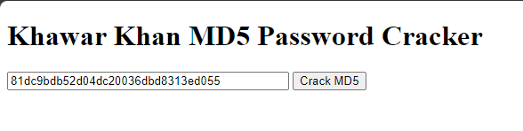

# MD5 PIN Cracker in PHP

Welcome to the "MD5 Password Cracker" repository by Khawar Khan. This PHP-based tool is designed to demonstrate the process of cracking MD5-hashed passwords using a brute-force approach.

## How it Works

The PHP script takes an MD5 hash as input and iterates through all possible 4-digit numeric PIN combinations, checking if the hash matches. Once a match is found, it reveals the PIN and displays the total number of checks performed during the cracking process.

## Prerequisites
- PHP installed on your machine.
- XAMPP installed on your machine. 
- A web server (e.g., Apache) to host the PHP files.
  
## Usage

1. Clone the Repository:
   ```bash
   git clone https://github.com/your-username/MD5-Password-Cracker-PHP.git
2. Navigate to the Program:
   ```bash
   cd MD5-Password-Cracker-PHP
3. Copy Repository in XAMPP's htdocs (if not cloned in htdocs):
   ```bash
   #for Windows
   xcopy /E MD5-Password-Cracker-PHP C:\xampp\htdocs\
   #for Linux/Unix
   cp -r MD5-Password-Cracker-PHP C:\xampp\htdocs\
4. Access the Program:
   * Open your web browser and go to:
   ```plaintext
   http://localhost/MD5-Password-Cracker-PHP/index.php
5. Usage:
   * Your PHP program should now be accessible locally, follow the on-screen instructions to interact with the application.
   * Input the MD5 hash in the provided form.
   * Click the "Crack MD5" button to initiate the cracking process.
6. Example:
   * Putting an md5 hashed PIN to crack.
     
  ## Troubleshooting
  If you encounter any issues, please check the following:
  * Ensure that XAMPP's Apache server is running.
  * Verify the correct path in the browser URL, including the folder name.
  * Check for any error messages in the XAMPP logs.

## Disclaimer
This repository is for educational purposes only. The use of password cracking tools without proper authorization is illegal and unethical.

## Author
Khawar Khan
